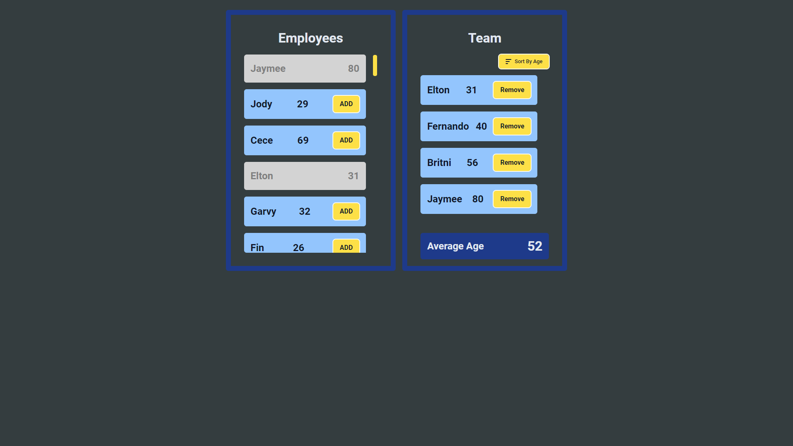

# Module#5 React Day #13 Homework: TeamMembers WebApp


## Hosted Version of the Project:
[m5react-day-13-homework-teammembers-webapp](https://m5react-day-13-homework-teammembers-webapp.vercel.app/)

## Project Overview:
Created a component with two boxes side by side as shown in the picture. The left box should show the list of all employees available in the company along with their age and an ADD button. The right box should show the list of employees added in the Team by pressing ADD button along with REMOVE button and the average age of all them team members.  

## Objectives
1. The Team Members box should be empty initially.
2. ADD button will add the employee to the Team box and will be disabled from Employee's List. Disabled can be shown by greying the employee’s details and removing ADD button.
3. REMOVE button in the Teams List will remove the employee from the Team and will be enabled in the Employee’s List. Enabled can be shown by changing back font color to black and showing ADD button against the employee.
4. You have to calculate the average age of all the Team Members and show it in the view as shown.
5. SORT BY AGE: on clicking this button the team members must be sorted in ascending order of their age.
6. Use separate component for left and right boxes.


## How to install and run in yours local machine
```bash
npm install
npm run start
```

## Tech. Stack Used:
+ [React](https://react.dev/)
+ [TailwindCSS](https://tailwindcss.com/)
+ [Google Fonts](https://fonts.google.com/)
+ [Font Awesome](https://fontawesome.com/icons/)

## Author
[Abhishek kumar](https://www.linkedin.com/in/alex21c/), ([Geekster](https://geekster.in/) MERN Stack FS-14 Batch)


